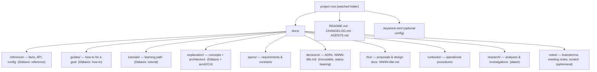

---
keystone:
  title: "A documentation structure for AI-generated docs"
  kind: design
  status: awaiting-review
---

# A documentation structure for AI-generated docs

> **What this is.** A research-backed proposal for how Keystone should recommend
> (and optionally enforce) a folder structure for AI-generated Markdown, so that
> a stream of specs, decisions, guides, and brainstorms stays legible instead of
> collapsing into a flat pile of `.md` files. It ends with a concrete, opinionated,
> configurable layout and a plan for how Keystone gets richer by knowing about it.

**Honesty note.** Where this document leans on an established standard (Diátaxis,
ADRs, RFC processes, arc42/C4), it says so and cites it. Where it proposes
something new — the Keystone `kind` taxonomy, the folder mapping, the review
policies per type — it is **synthesis**, clearly marked as *proposed*. The
industry has strong conventions for *documentation* and for *decisions*, weaker
ones for *AI-agent scratch output*; the gap in the middle is where Keystone adds
value.

---

## 1. The problem — why unstructured AI-generated Markdown becomes chaos

Keystone today watches a folder and treats every `*.md` as an artifact (see
[`SPEC.md`](./SPEC.md) §1). That is exactly right as a *contract*, but it means
the review queue is a flat, undifferentiated list. AI agents make this worse than
human authors ever did, for structural reasons:

1. **Volume and velocity.** An agent can emit a spec, three ADR-shaped decisions,
   a brainstorm, and a research memo in a single session. Humans write docs in
   days; agents write them in minutes. Flat folders that were "fine" at 20 files
   are unusable at 500.
2. **No native sense of lifecycle.** A throwaway brainstorm and a durable
   architecture reference look identical on disk — both are `something.md`. The
   reviewer can't tell what deserves careful review from what is scratch.
3. **Mixed audiences and intents collide.** A tutorial (for a newcomer), a
   reference (for a practitioner mid-task), and a decision record (for future
   maintainers) have opposite shapes and opposite review needs, yet land in the
   same directory.
4. **Naming entropy.** Agents invent filenames (`auth-thoughts.md`,
   `auth-thoughts-v2.md`, `final-auth.md`). Without a convention, there is no
   sort order, no sequence, no way to see "the current decision" vs. "a
   superseded one".
5. **Review fatigue → the loop breaks.** Keystone's value is the human-in-the-loop
   (README). If everything demands the same heavyweight review, reviewers stop
   reviewing. The fix is to let *type* drive *how much ceremony* a document gets.

The recurring insight from the documentation world is that **the failure is
almost always structural, not stylistic** — writers (and now agents) don't know
*what kind* of thing they're writing, so it comes out as an undifferentiated blob.
Diátaxis makes this its central thesis.[^diataxis]

---

## 2. A taxonomy of document types

The core move: **name the kinds of documents that actually exist**, then attach a
lifecycle, an audience, and a review policy to each. The table below is the
proposed Keystone taxonomy. It maps onto established frameworks where they apply
and fills the gaps (notes, research, agent plans/reports) that no framework
covers well.

| Kind | Purpose | Lifecycle | Primary audience | Needs review? | Maps to established standard |
|---|---|---|---|---|---|
| **spec** | Precise "what to build" — requirements, contracts, interfaces | Durable, revised | Implementers (human or agent) | **Yes — blocking** | (no single standard; closest to a PRD / functional spec) |
| **decision** (ADR) | One architectural choice + context + consequences | Durable, **immutable once accepted** (superseded, never edited) | Future maintainers | **Yes — explicit accept/reject** | ADR — Nygard / MADR[^nygard][^madr] |
| **rfc / proposal** | "Should we do this?" — a change put up for debate before work | Durable record; status flows draft→accepted/rejected | Team / stakeholders | **Yes — decision workflow** | RFC processes (Rust, React), PEP, KEP[^rustrfc][^reactrfc][^kep] |
| **design** (design doc) | High-level implementation strategy + trade-offs, pre-coding | Durable but ages; often archived after ship | Reviewers across disciplines | **Yes — comment-driven** | Google-style design docs[^googledesign] |
| **reference** | Accurate, complete technical facts (API, config, schema) | Durable, kept current | Practitioner mid-task | Light — accuracy checks | Diátaxis: *reference*[^diataxis] |
| **guide** (how-to) | Steps to accomplish a real goal for a competent user | Durable, kept current | Practitioner with a goal | Light | Diátaxis: *how-to guides*[^diataxis] |
| **tutorial** | A guided learning experience for a newcomer | Durable, kept current | Beginners | Light | Diátaxis: *tutorials*[^diataxis] |
| **explanation** | Background, concepts, "why it's like this" (incl. architecture) | Durable | Anyone studying the system | Light | Diátaxis: *explanation*; arc42 / C4 for architecture[^diataxis][^arc42][^c4] |
| **runbook** | Operational procedure: deploy, rollback, incident response | Durable, kept current | On-call / operators | Medium — correctness matters | (ops convention; a specialized how-to) |
| **research / analysis** | Investigation, options comparison, findings ("worktree-support-analysis") | Semi-durable; informs a decision then rests | Author + decision-makers | Optional — comment, not gate | (no standard; feeds RFCs/decisions) |
| **note / brainstorm** | Scratch thinking, meeting notes, open questions | **Ephemeral** | The author (and the agent) | **No — or lightweight ack** | (no standard; explicitly low-ceremony) |
| **plan** | An agent's task breakdown / execution plan | Ephemeral → consumed | The agent + reviewer | Yes — quick approve | AI-agent convention (task/plan files)[^agents] |
| **report** | An agent's after-the-fact result summary | Semi-durable | Reviewer | Read, rarely gated | AI-agent convention |
| **changelog** | Chronological record of shipped changes | Append-only, durable | Users / team | No — generated | Keep a Changelog[^changelog] |

Three things this table encodes that a flat folder cannot:

- **Ephemeral vs. durable** is a first-class property. Notes and brainstorms are
  *meant* to be disposable; specs and decisions are *meant* to outlive the
  session. Keystone can garbage-collect, archive, or de-emphasize the ephemeral.
- **Review ceremony is per-type.** ADRs and RFCs want an explicit, recorded
  verdict. Brainstorms want, at most, a thumbs-up. Forcing one workflow on both
  is why review queues rot.
- **Immutability differs.** An accepted ADR is a historical record: you don't
  edit it, you *supersede* it with a new one (this is the defining discipline of
  the ADR practice[^nygard]). A reference doc is the opposite — you keep editing
  it to stay true. Keystone should treat "edit" and "supersede" as different
  actions depending on `kind`.

### How the taxonomy relates to the three big frameworks

- **Diátaxis** cleanly covers four *documentation* kinds: tutorial, how-to,
  reference, explanation — organized by two axes (*action ↔ cognition*,
  *acquiring skill ↔ applying skill*).[^diataxis] It deliberately does **not**
  cover decisions, proposals, or scratch notes — that's out of its scope.
- **ADRs** cover exactly one kind — *decision* — and bring the crucial idea of an
  immutable, numbered, status-bearing record.[^nygard][^madr]
- **RFC / design-doc processes** cover the *proposal* kind — a document whose
  whole job is to be reviewed and then accepted or rejected, with a recorded
  outcome.[^rustrfc][^googledesign]

Keystone's taxonomy is the **union** of these three, plus the agent-native kinds
(plan, report, note, research) that none of them address.

---

## 3. Industry standards & what real repos do

### The frameworks

| Framework | Scope | Core idea | Where it lives | Source |
|---|---|---|---|---|
| **Diátaxis** | User documentation | 4 quadrants: tutorials / how-to / reference / explanation | `docs/` subfolders by quadrant | [diataxis.fr](https://diataxis.fr/)[^diataxis] |
| **ADR (Nygard, 2011)** | One decision each | Short, numbered, immutable; Context / Decision / Consequences | `doc/adr/` or `docs/decisions/` | [Nygard's post](https://www.cognitect.com/blog/2011/11/15/documenting-architecture-decisions)[^nygard] |
| **MADR** | ADRs in Markdown | Standardized template + numbering; full & minimal variants | `docs/decisions/` | [adr.github.io](https://adr.github.io/)[^madr] |
| **adr-tools** | ADR tooling | CLI to create/supersede numbered ADRs | `doc/adr/` by default | [Nat Pryce's adr-tools](https://github.com/npryce/adr-tools)[^nygard] |
| **Rust / React RFCs** | Proposals | Numbered Markdown in `text/`; PR-based accept/reject | dedicated `rfcs` repo, `text/NNNN-*.md` | [rust-lang/rfcs](https://github.com/rust-lang/rfcs)[^rustrfc][^reactrfc] |
| **Python PEP** | Proposals | Numbered, formal, status-tracked (Draft→Accepted→Final) | `peps/` | (PEP process, ref. by Rust RFC)[^rustrfc] |
| **Kubernetes KEP** | Enhancements | Numbered proposals under SIG subdirs, rich metadata | `keps/<sig>/NNNN-*/` | [kubernetes/enhancements](https://github.com/kubernetes/enhancements/tree/master/keps)[^kep] |
| **arc42** | Architecture | 12 fixed chapters for an arch document | one doc, chaptered | [arc42.org](https://arc42.org/)[^arc42] |
| **C4 model** | Architecture diagrams | Context / Container / Component / Code zoom levels | diagrams alongside arc42 | [c4model.com](https://c4model.com/)[^c4] |
| **Google design docs** | Design | Informal pre-coding doc; trade-offs; wide review | team doc store | [Design Docs at Google](https://www.industrialempathy.com/posts/design-docs-at-google/)[^googledesign] |
| **Keep a Changelog** | Changelog | Human-readable, chronological, grouped by change type | `CHANGELOG.md` at root | [keepachangelog.com](https://keepachangelog.com/)[^changelog] |

### What real repositories actually do

The pattern across large OSS projects is remarkably consistent: a top-level
`docs/` tree for user documentation, a **separate numbered space** for
proposals/decisions, and a few root-level convention files.

| Project | Docs layout | Decisions / proposals | Notable |
|---|---|---|---|
| **Kubernetes** | `site/content/…` docs | `keps/<sig>/NNNN-name/` numbered KEPs with metadata | Proposals in a *dedicated* `enhancements` repo[^kep] |
| **Rust** | `doc/` (the book, reference) | Separate `rfcs` repo, `text/NNNN-*.md` | RFC lifecycle drives the language[^rustrfc] |
| **React** | main-repo docs | Separate `reactjs/rfcs` repo, `text/` | Explicitly modeled on Rust/Yarn/Ember[^reactrfc] |
| **Astro / Starlight** | `src/content/docs/**` — each file becomes a page, front-matter schema-validated | RFCs in `withastro/roadmap` | Front-matter-driven; a strong model for typed docs[^starlight] |
| **arc42-based projects** | one architecture doc in 12 chapters, C4 diagrams as PlantUML | ADRs referenced from arc42 §9 | Docs-as-code in git[^arc42][^c4] |

Recurring conventions worth adopting:

- **Top-level `docs/`** for durable documentation.
- **A numbered decision/proposal space** (`docs/adr/`, `docs/decisions/`, or a
  `rfcs/` tree) with a strict `NNNN-kebab-title.md` naming scheme and a
  `status:` field. The numbering *is* the ordering and the identity.
- **Root convention files**: `README`, `CONTRIBUTING`, `CHANGELOG` — well-known
  names that tools and humans both recognize.

### Conventions specific to AI-agent workflows (emerging, not established)

Mark these clearly as **emerging**:

- **`AGENTS.md`** — an open spec (formalized August 2025, led by OpenAI with
  Google/Cursor/Factory; donated to the Linux Foundation's Agentic AI Foundation
  in December 2025; reportedly used across 60k+ repos by mid-2026) for giving
  agents project instructions. Hierarchical: global → project → folder.[^agents]
- **`.claude/`** — Claude Code's per-project config/skills directory (established
  within the Claude Code ecosystem, not an industry-wide standard).
- **`llms.txt`** — Jeremy Howard / Answer.AI proposal (Sept 2024): a root
  Markdown file listing LLM-friendly links for a site. Adopted by some vendors
  (Anthropic, Cloudflare, Vercel) but with **contested** real-world crawler
  uptake — genuinely emerging, not settled.[^llmstxt]
- **Task / plan / scratch files** — no standard yet. This is precisely the gap
  Keystone can define a convention for.

**Takeaway:** documentation *and* decisions are well-standardized; agent scratch
output is a green field. Keystone should adopt the settled conventions verbatim
and impose a light, sensible convention on the rest.

---

## 4. A recommended folder structure for Keystone

Opinionated default, fully overridable (§6). The organizing principle:
**durable knowledge is grouped by Diátaxis-style *purpose*; decisions and
proposals get numbered immutable spaces; agent scratch is quarantined in a
low-ceremony `notes/`/`research/` zone; a project can be flat and still work.**



As a tree:

```
project-root/                 ← the watched folder (a Keystone "project")
├── README.md
├── CHANGELOG.md              ← Keep a Changelog
├── AGENTS.md                 ← agent instructions (emerging convention)
├── .keystone.toml            ← optional: declares the structure (see §6)
└── docs/
    ├── reference/            kind: reference   (durable, keep current)
    ├── guides/               kind: guide       (durable)
    ├── tutorials/            kind: tutorial    (durable)
    ├── explanation/          kind: explanation (durable; architecture lives here)
    ├── specs/                kind: spec        (durable; blocking review)
    ├── decisions/            kind: decision    NNNN-*.md (immutable; accept/reject)
    │   └── 0001-use-tauri-for-shell.md
    ├── rfcs/                 kind: rfc         NNNN-*.md (proposals; decision workflow)
    │   └── 0007-inline-anchored-comments.md
    ├── runbooks/             kind: runbook     (durable ops)
    ├── research/             kind: research    YYYY-MM-DD-*.md (semi-durable)
    │   └── 2026-07-15-worktree-support-analysis.md
    └── notes/                kind: note        (ephemeral; low ceremony)
        └── 2026-07-15-auth-brainstorm.md
```

**Design choices, with rationale:**

- **Four Diátaxis quadrants are folders**, verbatim. This is the one taxonomy
  reviewers may already know, and it's the right split for *durable* docs.[^diataxis]
- **`decisions/` and `rfcs/` are separate numbered spaces.** A decision is *the
  outcome*; an RFC is *the argument*. Both use `NNNN-kebab-title.md`, matching
  Nygard/MADR and the Rust/React/KEP convention.[^nygard][^madr][^rustrfc][^kep]
  (A project that wants Nygard's original path can point `decisions` at
  `docs/adr/` — see §6.)
- **`specs/` is its own thing**, not folded into reference, because a spec is
  *prescriptive* ("build this") while reference is *descriptive* ("this is how it
  behaves"). Different review weight.
- **`research/` and `notes/` are the agent quarantine.** This is where the flood
  of AI scratch output goes. `research/` feeds decisions; `notes/` is disposable.
  Keeping them out of `docs/reference|guides|…` keeps the durable tree clean.
- **Architecture lives in `explanation/`** (optionally an `explanation/architecture/`
  subfolder), documented arc42-style with C4 diagrams — architecture *is*
  explanation in Diátaxis terms.[^arc42][^c4]
- **A flat project still works.** Per Keystone's SPEC, a bare `.md` in the root
  is a valid artifact. Folders are an *affordance*, never a requirement.

### Naming conventions

| Type | Filename pattern | Why |
|---|---|---|
| decisions (ADR) | `NNNN-kebab-title.md` (`0001-…`) | Monotonic sequence = identity + order; standard ADR practice[^nygard] |
| rfcs / proposals | `NNNN-kebab-title.md` | Matches Rust/React/KEP numbering[^rustrfc][^kep] |
| research / notes | `YYYY-MM-DD-kebab-title.md` | Chronological, self-sorting, dedupes "v2/final" churn |
| reference / guides / tutorials | `kebab-title.md` | Slug-friendly; each becomes a page (à la Starlight)[^starlight] |
| specs | `kebab-title.md` | Stable name; content revised in place |

### Front-matter is the source of truth, folders are a hint

Location is a *convenience*; the authoritative type is `keystone.kind` in
front-matter. This is the key robustness property: **a misfiled document is still
correctly typed.** A `kind: decision` file dropped in the root is still rendered,
sorted, and reviewed as a decision. Extend the existing SPEC front-matter:

```markdown
---
keystone:
  title: "Use Tauri for the desktop shell"
  kind: decision           # authoritative type (see expanded set, §5)
  status: accepted         # per-kind lifecycle status (§5)
  id: 0001                 # sequence number for decisions/rfcs
  supersedes: null         # decision lineage
  date: 2026-07-15
---
```

Resolution order Keystone should use: **`keystone.kind` front-matter → folder
mapping from `.keystone.toml` → default folder convention → `note` as fallback.**

---

## 5. How Keystone gets richer from this

Today Keystone renders a flat queue and writes `.feedback.md` siblings (SPEC
§1–2), with `kind` a free-form filter hint limited to `plan | design | report |
note`. Typing documents unlocks a materially better tool:

**Sidebar grouped by kind.** The review inbox becomes sections — *Specs*,
*Decisions*, *RFCs*, *Reference*, *Guides*, *Research*, *Notes* — with counts and
"needs-review" badges. The reviewer sees *shape* at a glance instead of a wall of
filenames. Grouping can key off front-matter `kind` (primary) or folder
(fallback).

**Filtering & saved views.** Filter by `kind`, by `status`, by ephemeral-vs-durable,
by "assigned to me". "Show me only decisions awaiting a verdict" is one click.

**Per-type review workflows** — the biggest win, because ceremony finally matches
the artifact:

| Kind | Proposed review action in Keystone |
|---|---|
| decision (ADR) | **Explicit Accept / Reject / Supersede.** Accepting writes `status: accepted` back into front-matter; rejecting records why; superseding scaffolds a new numbered ADR that links back. |
| rfc / proposal | **Decision workflow** with threaded comments and a final recorded verdict (draft → accepted/rejected). |
| spec | **Blocking review** — anchored comments; artifact can't be marked `done` until comments are resolved. |
| design | Comment-driven, Google-doc style; approve when reviewers are satisfied. |
| reference / guide / tutorial | **Lightweight accuracy pass**; anchored corrections, no gate. |
| runbook | Correctness check (medium ceremony). |
| research | Optional comments; "informs decision X" link, no gate. |
| note / brainstorm | **No verdict required** — at most an acknowledge/dismiss. Never blocks the queue. |
| plan | **Quick approve/adjust** — fast because the agent is waiting on it. |
| report / changelog | Read-only; mark seen. |

This maps onto the existing feedback verdict field (`approved | changes-requested
| rejected`, SPEC §2) but lets Keystone *choose which verdicts even apply* per
kind — an ADR offers Accept/Reject/Supersede; a note offers only Dismiss.

**Lifecycle & status tracking.** Because each kind carries a status, Keystone can
render lifecycle chips (`awaiting-review → in-review → accepted/rejected/superseded`)
and surface a decision log, an RFC pipeline, and a "stale docs" view (reference
untouched in N months). ADR immutability is enforced: editing an accepted
decision is nudged toward *supersede* instead.

**Auto-triage of the AI flood.** New artifacts land pre-sorted into the right
section by folder + front-matter. Ephemeral notes can be auto-collapsed or
auto-archived after N days, so the queue reflects *decisions and specs that
matter*, not every brainstorm the agent emitted.

### Proposed expanded, configurable `kind` set

Replace the fixed `plan | design | report | note` with a **default set** that is
extensible per project:

```
spec · decision · rfc · design · reference · guide · tutorial ·
explanation · runbook · research · note · plan · report · changelog
```

Each `kind` has defaults Keystone ships and a project can override: a **display
label**, a **default folder**, a **review policy** (blocking / verdict / comment /
none), a **lifecycle** (ephemeral / durable / immutable), and the **status values**
that apply. Unknown kinds degrade gracefully to `note`.

---

## 6. Configurability

The default must be a *recommendation*, not a cage. Keystone should:

1. **Ship the default structure** (§4) and offer, on project creation, to
   scaffold `docs/` with the standard subfolders — decline-able.
2. **Infer without any config** from front-matter `kind` first, folder names
   second. A project that never writes a config still gets grouped review as long
   as agents set `kind` (which the Claude/Codex review skills can do by default).
3. **Let a project declare its own mapping** in `.keystone.toml` at the watched
   folder root. Keystone reads it; nothing else does; it stays out of the artifact
   contract. Example:

```toml
# .keystone.toml — optional; declares this project's doc structure.
# Absent → Keystone uses its built-in defaults.

[structure]
docs_root = "docs"

# folder → kind. Lets a team keep its own layout (e.g. Nygard's doc/adr).
[structure.folders]
"docs/adr"          = "decision"    # this project uses the classic ADR path
"docs/rfcs"         = "rfc"
"docs/reference"    = "reference"
"docs/how-to"       = "guide"       # team calls them "how-to"
"docs/architecture" = "explanation"
"docs/research"     = "research"
"scratch"           = "note"        # non-docs scratch dir

# Per-kind overrides (else Keystone defaults apply).
[kinds.decision]
label        = "Decision (ADR)"
naming       = "NNNN-kebab-title"
review       = "verdict"            # blocking | verdict | comment | none
lifecycle    = "immutable"
statuses     = ["proposed", "accepted", "rejected", "superseded"]

[kinds.note]
label     = "Note / Brainstorm"
review    = "none"
lifecycle = "ephemeral"
archive_after_days = 30            # auto-collapse stale scratch

# Teams can add project-specific kinds.
[kinds.postmortem]
label     = "Postmortem"
review    = "comment"
lifecycle = "durable"
```

**Precedence** (most authoritative first): a file's `keystone.kind` front-matter →
`.keystone.toml` folder mapping → Keystone's built-in default folder convention →
`note`. Front-matter always wins, so a correctly-tagged file is correctly handled
no matter where it sits — the property that makes this robust against agents that
misfile things.

---

## 7. Recommendation & open questions

### Recommendation

1. **Adopt the taxonomy in §2** as Keystone's `kind` vocabulary, expanding the
   SPEC's four values to the fourteen in §5, extensible per project.
2. **Recommend (scaffold, don't force) the `docs/` structure in §4** — Diátaxis
   quadrants + numbered `decisions/`/`rfcs/` + quarantined `research/`/`notes/`.
   Every piece is a settled industry convention except the agent-scratch zone,
   which we're defining.
3. **Make front-matter `kind` authoritative, folders a hint** — misfiled files
   still get typed correctly.
4. **Drive review ceremony from `kind`** (§5 table). This is the feature that
   turns Keystone from a Markdown queue into a *review tool that understands what
   it's reviewing* — ADRs get accept/reject, brainstorms get left alone.
5. **Ship `.keystone.toml` for opt-in customization** (§6), with sane zero-config
   defaults.

### Open questions

- **How much does the agent need to know?** For grouped review to work zero-config,
  the Claude/Codex review skills must emit `keystone.kind`. Do we teach agents to
  place files *and* tag them, or tag-only and let Keystone place? (Recommendation:
  tag always; place when the agent knows the structure.)
- **ADR immutability vs. agent rewrites.** Keystone's whole loop is "agent
  rewrites the artifact in response to feedback" (SPEC §3). That conflicts with
  ADR immutability. Proposal: for `kind: decision`, feedback that would change the
  decision produces a *new superseding* ADR rather than an in-place rewrite. Needs
  design in the skill.
- **Ephemeral GC policy.** Auto-archiving notes after N days is convenient but can
  eat context an agent still wants. Archive (move/collapse) rather than delete?
- **One folder, many kinds.** Should a single folder be allowed to hold mixed
  kinds (resolved purely by front-matter), or should folder→kind be 1:1? (Lean:
  allow mixed, since front-matter is authoritative — but warn on mismatch.)
- **Cross-references.** Decisions reference RFCs; research informs decisions;
  specs cite explanations. Should Keystone parse and surface these links as a
  graph? High value, later phase.
- **Standard alignment vs. our own labels.** Do we expose "Diátaxis" / "ADR" /
  "RFC" language in the UI (educational, credible) or neutral labels
  (approachable)? Probably: standard names with tooltips.

---

## Appendix: mapping to the current SPEC

| Today (SPEC) | Proposed |
|---|---|
| `kind: plan \| design \| report \| note` (free-form) | 14-value default set, extensible (§5) |
| `status: awaiting-review \| in-review \| done` | per-kind lifecycles incl. `accepted/rejected/superseded` (§5) |
| flat watched folder | recommended `docs/` structure, still flat-compatible (§4) |
| `verdict: approved \| changes-requested \| rejected` | per-kind verdict sets (ADR: accept/reject/supersede) (§5) |
| no project config | optional `.keystone.toml` (§6) |

---

### Sources

[^diataxis]: Diátaxis documentation framework — Daniele Procida. <https://diataxis.fr/> and "Start here" <https://diataxis.fr/start-here/>. Four kinds: tutorials, how-to guides, reference, explanation.
[^nygard]: Michael Nygard, "Documenting Architecture Decisions" (2011). <https://www.cognitect.com/blog/2011/11/15/documenting-architecture-decisions>. Also Fowler's summary <https://martinfowler.com/bliki/ArchitectureDecisionRecord.html> and Nat Pryce's `adr-tools` <https://github.com/npryce/adr-tools> (default path `doc/adr/`, monotonic numbering).
[^madr]: MADR (Markdown Any Decision Records) and the ADR org. <https://adr.github.io/> and templates <https://adr.github.io/adr-templates/>; curated examples <https://github.com/joelparkerhenderson/architecture-decision-record>.
[^rustrfc]: The Rust RFC Book / process. <https://rust-lang.github.io/rfcs/> and <https://github.com/rust-lang/rfcs> (`text/NNNN-*.md`; inspired by Python's PEP process).
[^reactrfc]: React RFCs. <https://github.com/reactjs/rfcs> (modeled on Yarn/Rust/Ember RFC processes).
[^kep]: Kubernetes Enhancement Proposals. <https://github.com/kubernetes/enhancements/tree/master/keps> and <https://www.kubernetes.dev/resources/keps/> (numbered, per-SIG subdirs, rich metadata).
[^googledesign]: "Design Docs at Google" — Malte Ubl. <https://www.industrialempathy.com/posts/design-docs-at-google/>.
[^arc42]: arc42 architecture template (Starke & Hruschka), 12 chapters. <https://arc42.org/> ; example with C4 <https://github.com/bitsmuggler/arc42-c4-software-architecture-documentation-example>.
[^c4]: C4 model (Simon Brown) — Context / Container / Component / Code. <https://c4model.com/>.
[^changelog]: Keep a Changelog. <https://keepachangelog.com/>.
[^starlight]: Astro Starlight project structure — content in `src/content/docs/**`, front-matter schema per file. <https://starlight.astro.build/guides/project-structure/>.
[^agents]: AGENTS.md standard — open spec (Aug 2025; donated to the Linux Foundation Agentic AI Foundation, Dec 2025). <https://agentsstandard.com/> ; background <https://llms-txt.io/blog/what-is-agents-md>. **Emerging.**
[^llmstxt]: Jeremy Howard / Answer.AI, "/llms.txt — a proposal…" (Sept 2024). <https://www.answer.ai/posts/2024-09-03-llmstxt.html>. Adoption real but crawler uptake contested. **Emerging.**
