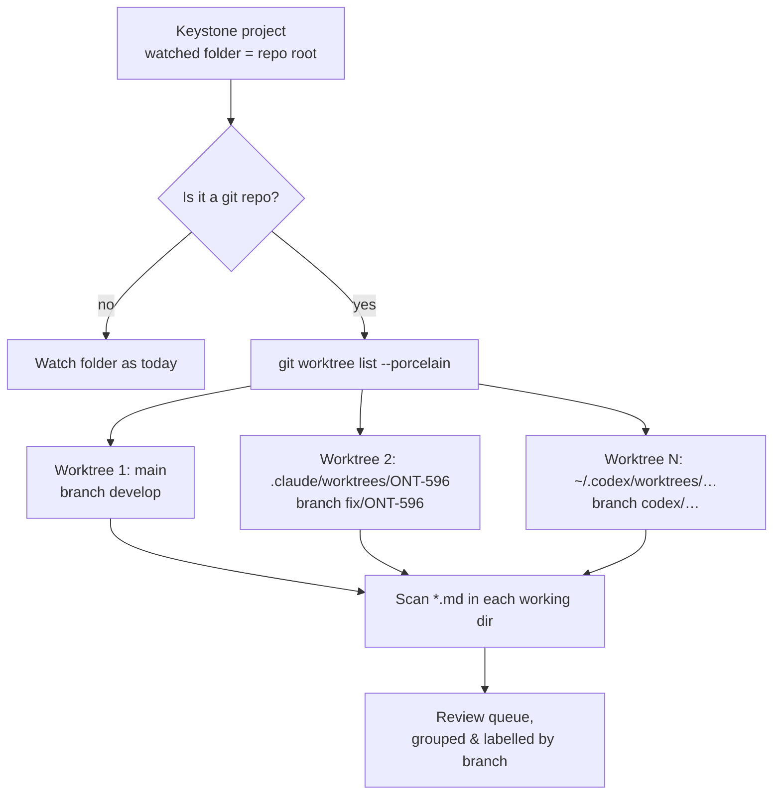

---
keystone:
  title: "Supporting git worktrees"
  kind: design
  status: awaiting-review
---

# Supporting git worktrees

## Problem statement

A Keystone **project** watches exactly **one folder, non-recursively**. It surfaces Markdown artifacts that an AI agent drops into that folder so a human can review them.

Git **worktrees** break this model. A worktree is a *second working directory* attached to the same repository, living at a **different path on disk**. When an AI coding agent (Claude Code, Codex) runs inside a worktree, any Markdown it writes lands in the worktree's directory — **not** in the main repo folder Keystone is watching.

```
repo/                         <-- Keystone watches THIS folder
├── analysis.md               ✅ seen
└── .claude/worktrees/
    └── ONT-596/
        └── analysis.md       ❌ NOT seen (different working dir, and non-recursive)
```

Result: artifacts produced during worktree-isolated work are **invisible** to Keystone. The reviewer never sees them, or (worse) only sees the stale copy on the main branch.

Two things make this concrete on the tested machine (`claude` v2.1.210, `codex` present):

- Every worktree's working directory is a normal directory somewhere on disk — often **inside a dot-folder** relative to the repo.
- The worktree "belongs to" a specific **branch**, which is exactly the context a reviewer needs to judge the artifact.

---

## How Claude Code creates worktrees

Claude Code exposes a first-class worktree flag (verified via `claude --help`, v2.1.210):

```
-w, --worktree [name]   Create a new git worktree for this session
                        (optionally specify a name)
--tmux                  Create a tmux session for the worktree (requires --worktree)
```

**Dot-folder answer (verified on this machine):** the native `--worktree` feature creates the worktree inside the repository at:

```
<repo-root>/.claude/worktrees/<name>/
```

Verified evidence from `/Users/mathiasdierickx/git/ontracx/ontracx-backend`:

| Signal | Value (verified) |
|---|---|
| Working dir | `<repo>/.claude/worktrees/ONT-596/` |
| `git worktree list` entry | `…/ontracx-backend/.claude/worktrees/ONT-596  [fix/ONT-596-…]` |
| `.git` inside worktree | file containing `gitdir: <repo>/.git/worktrees/ONT-596` |
| Metadata `gitdir` pointer | `<repo>/.git/worktrees/ONT-596/gitdir` → `<repo>/.claude/worktrees/ONT-596/.git` |
| `.gitignore` | `.claude/worktrees/` is ignored (line 29) — so the dir is untracked by design |
| Name | Defaults to the session/branch label (e.g. `ONT-596`, `notif-route-surface`); overridable via `--worktree <name>` |

So: **inside the repo, under the `.claude/` dot-folder, one sub-directory per worktree, named after the branch/session, and git-ignored.** This is the single most important fact for discovery: Keystone can find these deterministically relative to a watched repo.

> Caveat / not the native feature: the same machine also has sibling-style worktrees (`ontracx-backend-ONT-801/`) and a repo-level `worktrees/` folder. Those were created by Claude Code running **raw `git worktree add`** commands under the user's own naming conventions (confirmed in `~/.claude/history.jsonl`), **not** by the `-w` flag. Takeaway: the `.claude/worktrees/` path is reliable for the *native* feature, but agents can and do put worktrees **anywhere**. Discovery must not hard-code a single path — see the git-based approach below.

---

## How Codex creates worktrees

Two distinct mechanisms, so be precise:

**1. Codex Desktop / app environments (per OpenAI docs):**

> "Codex creates worktrees in `$CODEX_HOME/worktrees`." Configurable via **Settings → Worktrees → Worktree root**.

- Default `$CODEX_HOME` is `~/.codex`, so the default is `~/.codex/worktrees/` — a **global dot-folder in the user's home**, *outside any repo*.
- **Could not verify on this machine:** `~/.codex/` exists but `~/.codex/worktrees/` does **not** (this user hasn't used that feature). So the path is confirmed from docs, not from disk here.
- Implication for Keystone: these worktrees are **not reachable** by watching or scanning a repo folder — they sit under the user's home. Only git enumeration from the repo (which lists absolute paths anywhere on disk) will find them.

**2. Codex CLI "rescue"/plugin pattern (from `openai/codex-plugin-cc`):**

- Creates the worktree in-repo at `.worktrees/codex-<timestamp>` with branch `codex/<timestamp>`, via `git worktree add .worktrees/codex-<timestamp> -b codex/<timestamp>`.
- **Partially verified:** a `.worktrees/` dot-folder exists in `…/ontracx-backend/` on this machine (currently empty), consistent with this pattern having been used.

**Net:** Codex has **no single canonical location** — it's `~/.codex/worktrees` (global, configurable) for the app, or an in-repo `.worktrees/` dot-folder for the CLI rescue flow. Path-convention watching alone cannot cover Codex reliably.

---

## Git worktree discovery mechanics

The robust, tool-agnostic way to find every worktree of a repo is to ask git — it tracks them regardless of where on disk they live.

**Enumerate worktrees (machine-readable):**

```bash
git -C <repo> worktree list --porcelain
```

Output is a stanza per worktree:

```
worktree /Users/…/ontracx-backend
HEAD 115e4a16…
branch refs/heads/develop

worktree /Users/…/ontracx-backend/.claude/worktrees/ONT-596
HEAD ea1ddbf5…
branch refs/heads/fix/ONT-596-remove-screening-band-cutoff
```

Parse each stanza for:
- `worktree <abs-path>` — the working directory (may be anywhere on disk),
- `branch refs/heads/<name>` — the branch (or `detached`),
- `HEAD <sha>` — the commit.

**Underlying files (for reference / fallback):**

- `<repo>/.git/worktrees/<name>/` — per-worktree metadata directory in the *main* repo.
- `<repo>/.git/worktrees/<name>/gitdir` — points at the linked worktree's `.git` file.
- Inside a linked worktree, `.git` is a **file** (not a directory) containing `gitdir: <repo>/.git/worktrees/<name>` — a reliable way to detect "this directory is a linked worktree."

**Finding Markdown artifacts inside a worktree:** once you have each worktree's absolute working-dir path, apply the *same* artifact-detection Keystone already uses for the main folder (scan for `*.md`, optionally filter by the `keystone:` front-matter). A worktree's working dir is just a normal directory tree; nothing git-specific is needed to read files from it.



---

## Design options for Keystone

| # | Approach | How it finds worktree artifacts | Pros | Cons / risks |
|---|---|---|---|---|
| A | **Recursively scan** the watched folder | Walk subdirectories, incl. `.claude/worktrees/` | Simple; no git dependency; catches in-repo dot-folder worktrees | Misses out-of-repo worktrees (`~/.codex/worktrees`, sibling dirs); **high noise** (node_modules, build output, vendored `*.md`); no branch context; perf cost on big trees |
| B | **Auto-detect the repo and enumerate worktrees via git** | `git worktree list --porcelain`, then scan each working dir | **Correct & complete** — finds worktrees anywhere on disk; gives **branch + commit** for free; naturally scoped to this repo | Requires git; only covers worktrees git knows about (an agent writing to a random non-worktree dir is still missed); need to watch N dynamic paths |
| C | **Let the user add multiple folders** per project | User manually points Keystone at each worktree dir | Zero magic; works for any tool/layout; explicit | Manual, error-prone; worktrees are created/destroyed constantly by agents — users won't keep up; defeats "it just shows up" UX |
| D | **Watch a dot-folder convention** (`.claude/worktrees/`, `.worktrees/`) | Watch known dot-folders relative to repo | Cheap; catches the common Claude Code case verified here | Convention-fragile: misses Codex app (`~/.codex/worktrees`), sibling-named worktrees, and any custom `git worktree add` path; two agents = two+ conventions to chase |

**Trade-off summary**

- **Noise / correctness:** A is noisiest (scans everything); B is precise (git says exactly which dirs are worktrees) and hands you the branch label so artifacts can't be mis-attributed.
- **Coverage:** Only B reaches worktrees that live *outside* the repo (Codex app default, sibling dirs). D covers just the in-repo dot-folder cases. A covers in-repo only.
- **Attribution (which branch does this artifact belong to?):** B and D can label by branch; A cannot without extra work; C relies on the user knowing.
- **Performance:** B watches a small, known set of directories (one per worktree) instead of recursively walking a large tree.

---

## Recommendation

**Adopt Option B (git-driven worktree enumeration) as the primary mechanism, with Option D's dot-folder watch as a lightweight complement, and keep Option C as a manual escape hatch.**

Rationale: B is the only approach that is both **correct** (git authoritatively lists worktree paths, wherever they are) and **branch-aware** (the reviewer sees *which branch* an artifact came from). The Keystone backend is a Tauri/Rust process (`src-tauri/`) that can shell out to `git` cleanly.

### Implementation sketch

1. **Detect repo on project open.** For a watched folder `F`, run `git -C F rev-parse --show-toplevel`. If it fails, behave exactly as today (single-folder, non-recursive). If it succeeds, enable worktree mode.

2. **Enumerate worktrees.**
   ```bash
   git -C <repo> worktree list --porcelain
   ```
   Parse stanzas into `{ path, branch, head }`. This yields the main working dir plus every linked worktree, each an absolute path.

3. **Watch each working dir.** Register a (non-recursive, matching today's semantics) file watcher on each worktree path for `*.md`. Because worktrees come and go, **re-run enumeration** on a trigger: a debounced timer, on window focus, and/or on filesystem events under `<repo>/.git/worktrees/` (git touches that dir when worktrees are added/removed/pruned).

4. **Group & label the review queue by worktree/branch.** Each artifact carries `{ worktreePath, branch, isMainWorktree }`. In the UI:
   - Group artifacts under a heading per worktree, labelled by **branch name** (`fix/ONT-596-…`), with the main worktree pinned first.
   - Badge each item with its branch so a reviewer never confuses a worktree draft with the main-branch version.
   - De-duplicate by relative path + content hash so an unchanged file shared across worktrees isn't shown N times (optional; only if it proves noisy).

5. **Ignore noise.** Even in git mode, skip `node_modules/`, build outputs, and (unless explicitly opted in) treat `.claude/worktrees/` / `.worktrees/` as worktree roots to enumerate — **not** as folders to recursively scan.

6. **Complement (Option D):** additionally watch `<repo>/.claude/worktrees/` for creation events as a fast path, since that's the verified Claude Code default — but always resolve the actual set via git so out-of-repo worktrees (Codex) are still covered.

### Which git commands

| Purpose | Command |
|---|---|
| Is this a repo? / repo root | `git -C <dir> rev-parse --show-toplevel` |
| List all worktrees + branches | `git -C <repo> worktree list --porcelain` |
| Detect stale entries | `git -C <repo> worktree prune --dry-run` (optional hygiene) |
| Branch of a given worktree dir | `git -C <worktree> rev-parse --abbrev-ref HEAD` |

---

## Open questions

1. **Scope of watching:** should worktree mode be **opt-in per project** (a checkbox) or automatic when a repo is detected? Automatic is friendlier but changes behavior for existing single-folder projects.
2. **Recursion inside a worktree:** today Keystone is non-recursive. Do agents drop artifacts only at the worktree root, or in subfolders (e.g. `docs/`, `.claude/`)? If subfolders matter, worktree mode needs a bounded recursive scan — which reintroduces the noise problem.
3. **Out-of-repo worktrees & permissions:** Codex's default `~/.codex/worktrees` lives under the user's home, outside the project folder. Does Keystone's file-access model (Tauri capability scopes) permit watching arbitrary absolute paths returned by git? **Could not verify** without inspecting `src-tauri/` capabilities.
4. **Artifact identity across branches:** when the *same* artifact filename exists on `main` and in a worktree with different content, is that **two review items** or **one item with versions**? Affects queue grouping and de-dup.
5. **Lifecycle / cleanup:** when a worktree is removed (`git worktree remove`) after merge, what happens to any still-pending review items that came from it — auto-dismiss, keep as historical, or flag as orphaned?
6. **Bare / nested repos & submodules:** the tested machine has nested repos (`unidose-connect/unidose-connect`) and repo-level `worktrees/` folders. Enumeration should key off the resolved top-level, and decide how to handle a watched folder that is itself a linked worktree (walk back to the main repo, or treat locally?).
7. **Non-git agents:** if an agent writes Markdown to a directory that is *not* a registered git worktree, git won't report it. Is that in scope, or explicitly out of scope (Option C manual-add territory)?
