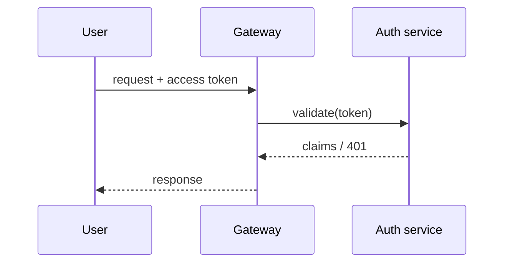

---
keystone:
  title: "Auth service — architecture proposal"
  kind: design
  status: awaiting-review
---

# Auth service — architecture proposal

A proposal to split authentication out of the monolith into a dedicated
service, behind a thin gateway.

## Goals

- Single source of truth for identity
- Token issuance decoupled from the app tier
- Zero-downtime migration path

## Token refresh

We use a **sliding expiry**: every authenticated request extends the session
by 30 minutes. Sessions never hard-expire while the user stays active.

> ⚠️ Open question: should we add an absolute cap?

## Data model

| Table      | Key columns              | Notes                     |
| ---------- | ------------------------ | ------------------------- |
| `sessions` | `id`, `user_id`, `expires_at` | one row per active session |
| `tokens`   | `jti`, `session_id`      | issued access tokens      |

## Request flow



## Middleware sketch

```ts
export async function requireAuth(req: Request): Promise<Claims> {
  const token = req.headers.get("authorization")?.replace("Bearer ", "");
  if (!token) throw new Unauthorized();
  return verify(token);
}
```

## Rollout

- [x] Stand up the service in shadow mode
- [ ] Mirror traffic, compare responses
- [ ] Cut over gateway routing
